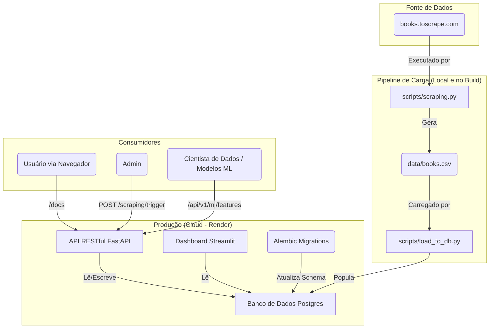

# Tech Challenge - Fase 1: API Pública de Livros 📚

Projeto da Pós-Graduação em **Machine Learning Engineering**. O objetivo deste desafio é construir um pipeline de dados completo: desde a extração (scraping) de dados de livros, passando pela transformação e armazenamento, até a disponibilização final através de uma API RESTful pública e escalável

Esta solução inclui a API (FastAPI), um banco de dados (Postgres), um dashboard de monitoramento (Streamlit), e todo o processo de deploy automatizado (Render).

---

## 🚀 Links do Projeto (Entregáveis)

* **API (Render):** `<COLE_AQUI_O_LINK_DO_DEPLOY_DA_API>` 
* **Dashboard (Render):** `<COLE_AQUI_O_LINK_DO_DEPLOY_DO_DASHBOARD>`
* **Vídeo de Apresentação:** `<COLE_AQUI_O_LINK_DO_VÍDEO>` 
* **Certificado Bônus (Google Cloud):** `<COLE_AQUI_O_LINK_PÚBLICO_DO_SEU_BADGE>`

---

## 🏛️ Diagrama da Arquitetura

Este projeto foi desenhado como um sistema desacoplado, hospedado na nuvem do Render, permitindo que a API e o Dashboard escalem de forma independente.


```mermaid
graph TD
    subgraph "Fonte de Dados"
        A(books.toscrape.com)
    end

    subgraph "Pipeline de Carga (Local e no Build)"
        B[scripts/scraping.py] -- Gera --> C(data/books.csv)
        C -- Carregado por --> D[scripts/load_to_db.py]
    end

    subgraph "Produção (Cloud - Render)"
        E[Banco de Dados Postgres]

        F[API RESTful FastAPI]
        F -- Lê/Escreve --> E
        
        G[Dashboard Streamlit]
        G -- Lê --> E

        H(Alembic Migrations) -- Atualiza Schema --> E
    end

    subgraph "Consumidores"
        I(Usuário via Navegador) -- /docs --> F
        J(Admin) -- POST /scraping/trigger --> F
        K(Cientista de Dados / Modelos ML) -- /api/v1/ml/features --> F
    end

    A -- Executado por --> B
    D -- Popula --> E
```

---

## ✨ Features Implementadas

* **API RESTful (FastAPI):** Endpoints robustos para consulta, busca e estatísticas[cite: 27, 28].
* **Banco de Dados (Postgres):** Banco de dados relacional e escalável para produção (e SQLite para desenvolvimento local).
* **Migrações (Alembic):** Versionamento e gerenciamento profissional do schema do banco de dados.
* **Endpoints Core:** `GET /books`, `GET /books/{id}`, `GET /books/search`, `GET /categories`, `GET /health`[cite: 55, 57, 58, 59, 60].
* **Endpoints Opcionais:** `GET /stats/overview`, `GET /stats/categories`, `GET /books/top-rated`, `GET /books/price-range`[cite: 63, 64, 67, 68].
* **Endpoints Bônus (Segurança):** Autenticação `JWT` (`/auth/login`) [cite: 71, 74] e rota de admin protegida (`/scraping/trigger`)[cite: 76].
* **Endpoints Bônus (ML-Ready):** Rotas `/ml/features` e `/ml/training-data` para consumo direto por modelos de ML[cite: 79, 80].
* **Monitoramento (Streamlit):** Dashboard interativo para análise das métricas da base de dados[cite: 84].
* **Deploy (Render):** Infraestrutura como Código (`render.yaml`) para deploy automatizado e contínuo[cite: 31, 32].

---

## 🛠️ Tech Stack

* **Backend:** FastAPI, Uvicorn, Gunicorn
* **Banco de Dados:** PostgreSQL (Produção), SQLite (Dev), SQLAlchemy (ORM), Alembic (Migrações)
* **Segurança:** Passlib (Hashing), Python-JOSE (JWT)
* **Scraping:** Requests, BeautifulSoup4, Pandas
* **Dashboard:** Streamlit, Plotly
* **Deploy:** Render
* **Bônus:** Google Cloud ML APIs (Vision, Translation, Natural Language)

---

## 🚀 Como Rodar Localmente (Desenvolvimento)

Siga os passos abaixo para executar o projeto na sua máquina.

1.  **Clone o repositório:**
    ```bash
    git clone [https://github.com/douglas-varjao/mlops-book-scraper.git](https://github.com/douglas-varjao/mlops-book-scraper.git)
    cd mlops-book-scraper
    ```

2.  **Crie e ative um ambiente virtual:**
    ```bash
    python -m venv venv
    source venv/bin/activate  # No Windows: venv\Scripts\activate
    ```

3.  **Instale as dependências:**
    ```bash
    pip install -r requirements.txt
    ```

4.  **Configure as variáveis de ambiente:**
    (Copia o arquivo de exemplo. Ele já vem configurado para usar o SQLite local.)
    ```bash
    cp .env.example .env
    ```
    *(Opcional: Gere uma nova `SECRET_KEY` com `openssl rand -hex 32` e atualize o `.env`)*

5.  **Crie as Tabelas no Banco (Alembic):**
    (Isso irá criar o arquivo `local.db` com as tabelas `books` e `users`.)
    ```bash
    alembic upgrade head
    ```

6.  **Execute o Scraper:**
    (Isso irá criar o arquivo `data/books.csv` com os dados extraídos.)
    ```bash
    python scripts/scraping.py
    ```

7.  **Crie o Usuário Admin:**
    (Isso lê as credenciais `INIT_ADMIN...` do `.env` e cria o admin no banco.)
    ```bash
    python scripts/create_admin.py
    ```

8.  **Popule o Banco de Dados:**
    (Isso lê o `data/books.csv` e o carrega no `local.db`.)
    ```bash
    python scripts/load_to_db.py
    ```

9.  **Inicie a API (FastAPI):**
    ```bash
    uvicorn api.main:app --reload
    ```
    * Acesse a API em: [http://127.0.0.1:8000](http://127.0.0.1:8000)
    * Acesse a documentação: [http://127.0.0.1:8000/docs](http://127.0.0.1:8000/docs)
    * Acesse as métricas: [http://127.0.0.1:8000/metrics](http://127.0.0.1:8000/metrics)

10. **Inicie o Dashboard (Streamlit):**
    *(Em um novo terminal, com o `venv` ativado)*
    ```bash
    pip install -r streamlit_dashboard/requirements.txt
    streamlit run streamlit_dashboard/dashboard.py
    ```
    * Acesse o Dashboard em: [http://127.0.0.1:8501](http://127.0.0.1:8501)

---

##↔️ Documentação dos Endpoints (Exemplos)

Use `curl` ou o `/docs` interativo para testar os endpoints.

### Health Check
```bash
curl -X 'GET' '[http://127.0.0.1:8000/api/v1/health](http://127.0.0.1:8000/api/v1/health)'
```
> **Response:** `{"status":"ok","database":"connected"}`

### Listar Livros (Paginado)
```bash
curl -X 'GET' '[http://127.0.0.1:8000/api/v1/books?limit=2](http://127.0.0.1:8000/api/v1/books?limit=2)'
```
> **Response:** `[{"title":"A Light in the Attic",...}, {"title":"Tipping the Velvet",...}]`

### Buscar por Categoria
```bash
curl -X 'GET' '[http://127.0.0.1:8000/api/v1/books/search?category=Travel](http://127.0.0.1:8000/api/v1/books/search?category=Travel)'
```

### Buscar por Título
```bash
curl -X 'GET' '[http://127.0.0.1:8000/api/v1/books/search?title=The%20Black%20Maria](http://127.0.0.1:8000/api/v1/books/search?title=The%20Black%20Maria)'
```

### Ver Estatísticas
```bash
curl -X 'GET' '[http://127.0.0.1:8000/api/v1/stats/overview](http://127.0.0.1:8000/api/v1/stats/overview)'
```
> **Response:** `{"total_books":1000,"average_price":35.07,"rating_distribution":...}`

### Fazer Login (Obter Token JWT)
```bash
curl -X 'POST' '[http://127.0.0.1:8000/api/v1/auth/login](http://127.0.0.1:8000/api/v1/auth/login)' \
 -H 'Content-Type: application/x-www-form-urlencoded' \
 -d 'username=admin&password=supersecurepassword123'
```
> **Response:** `{"access_token":"eyJ...","token_type":"bearer"}`

### Acessar Rota Protegida (ML Features)
*(Substitua `$TOKEN` pelo `access_token` obtido no login)*
```bash
curl -X 'GET' '[http://127.0.0.1:8000/api/v1/ml/features](http://127.0.0.1:8000/api/v1/ml/features)' \
 -H 'Authorization: Bearer $TOKEN'
```
> **Response:** `[{"book_id":1,"price":51.77,"rating":3,...}, ...]`